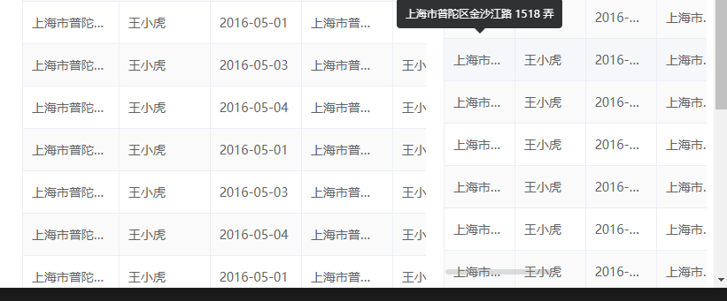
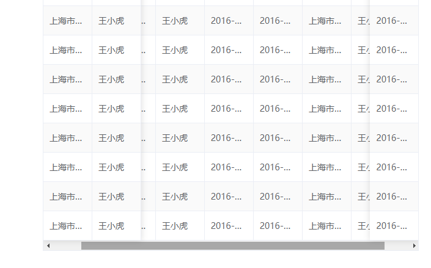
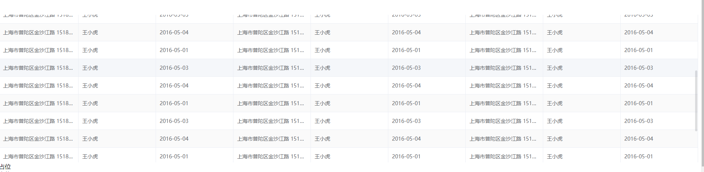

# `el-table-bar-base`

> 自定义`element-ui` 表格滚动条组件 by Jdes on 2019-02-18

> 由于 `npm` 的 OTP 验证问题,原来的 `el-table-bar` 迁移至 `el-table-bar-base` 请使用者删除原始包后下载 `el-table-bar-base` 原有功能不变

## update Log


### v2.1.1

- 提供纵向滚动功能，开启此功能传入`height`属性即可。具体见API列表

### v2.1.0

- 修复IE11 无法使用的bug

### v2.0.9

- 新增`native`属性，在设置表格`fixed`贴合情况下还原滚动条

### v2.0.7

- 新增类型声明文件`.d.ts`

### v2.0.6

- 说明文档更新

#### v2.0.5

- 修复 `offsetLeft` 在嵌套路由下出现的计算偏差

- 使用 `getBoundingClientRect` 获取相应的距离参数

- 新增 `static` 模式

#### v2.0.3

- 更新浏览器兼容性，修改 `Firefox` 兼容策略

#### v2.0.2

- 正式版本更新

- 修复若干 bug

- 感谢 [suchenglin2017](https://github.com/suchenglin2017) 提供的新思路

#### tips

> 开启横向滚动条自适应功能之后，可能会出现滚轮滚动，表格滚动到底部时，滚动条没有复位的情况。此时，鼠标移动（进出表格）即可解决，或者调低 滚轮响应延迟
> 此项问题不是 bug 是因为做了函数节流优化，为了性能不得不做出的妥协，望周知。
> 另：滚轮响应延迟在 `FireFox` 下会有短暂响应延迟，功能不受影响

### API

| props  | type    | default | explain                                                                        |
| ------ | ------- | ------- | ------------------------------------------------------------------------------ |
| fixed  | Boolean | false   | 开启滚动条自适应                                                               |
| bottom | Number  | 15      | 滚动条自适应距离窗口底部距离                                                   |
| delay  | Number  | 300(ms) | 滚轮响应延迟                                                                   |
| static | Boolean | false   | 静态表格,有预设值的表格请设置此项                                              |
| native | Boolean | false   | 设置`elTableColumn`表格`fixed`属性必须设置此项还原滚动条，否则`fixed` 不会生效 |
| height | Number、String | auto | 开启纵向滚动功能，数字输入则默认单位`px`。此功能与fixed模式冲突，开启fixed模式则会丢弃该参数  |

### 示例&example

#### default


#### fixed




#### native



### scrollY



### 安装 - Install

你可以使用 yarn 或者 npm

```shell
yarn add el-table-bar-base
```

or

```shell
npm i el-table-bar-base
```

### 用法 - Usage

`main.js`

```js
import ElTableBar from 'el-table-bar-base'
import 'el-table-bar-base/lib/ElTableBar.css'

Vue.use(ElTableBar)
```

### 模板语法 - Template

```html
<template>
  <div>
    <el-table-bar>
      <el-table>
        ...
      </el-table>
    </el-table-bar>
  </div>
</template>
```
